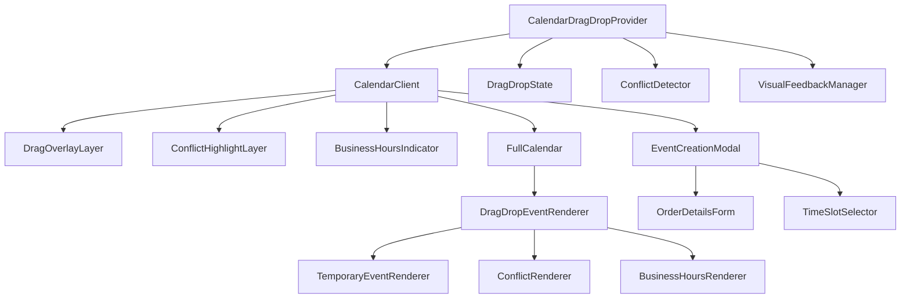
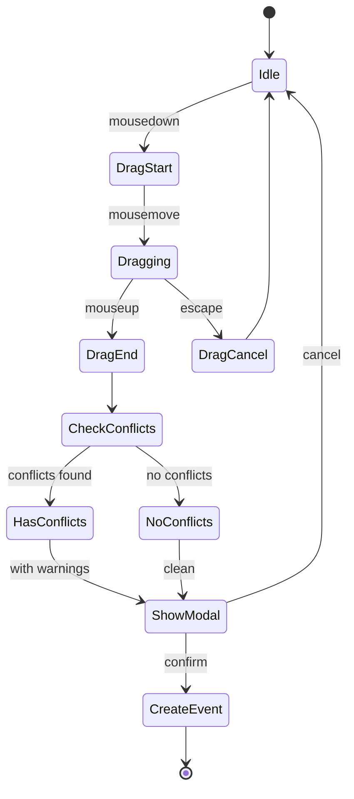
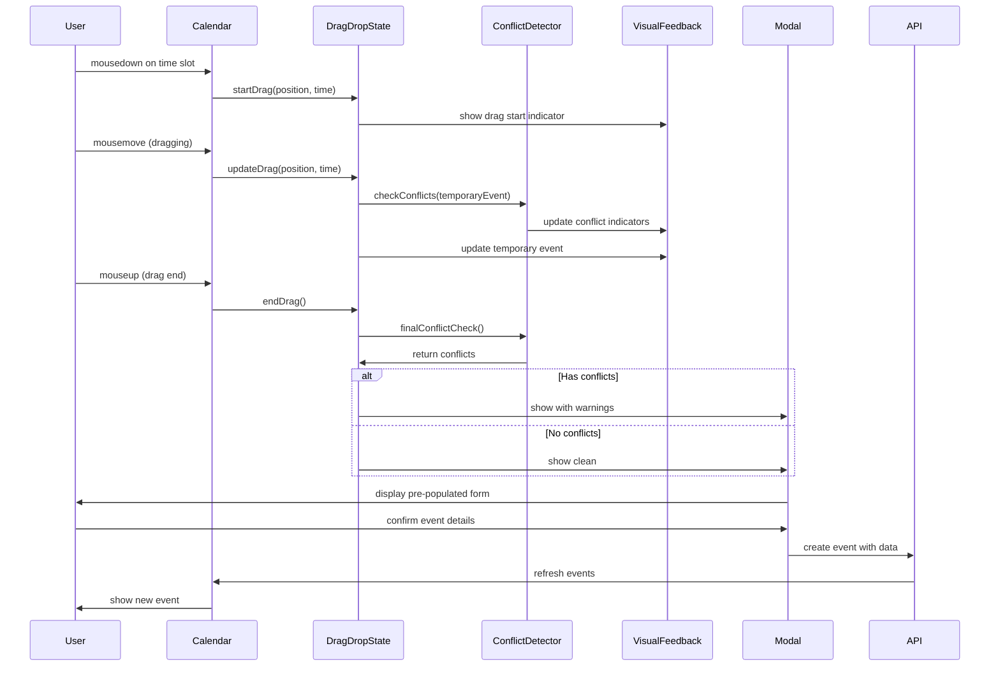
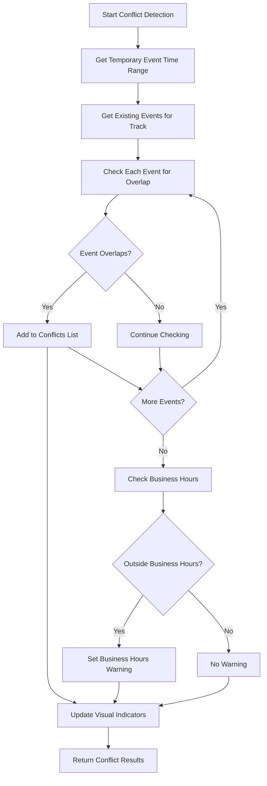

# Comprehensive Drag-and-Drop Interaction Architecture for Calendar Event Creation

## Executive Summary

This document outlines a comprehensive architecture for implementing intuitive drag-and-drop event creation on the calendar system. The solution leverages the existing FullCalendar and @dnd-kit implementations while maintaining compatibility with the current order workflow.

## 1. Component Architecture

### 1.1 Core Components

```
CalendarDragDropProvider (Context)
├── DragDropState (State Management)
├── ConflictDetector (Business Logic)
├── VisualFeedbackManager (UI/UX)
└── EventCreationFlow (Orchestration)

CalendarClient (Enhanced)
├── DragOverlayLayer
├── ConflictHighlightLayer
├── BusinessHoursIndicator
└── EventCreationModal

DragDropEventRenderer
├── TemporaryEventRenderer
├── ConflictRenderer
└── BusinessHoursRenderer
```

### 1.2 Component Hierarchy



### 1.3 Component Responsibilities

#### CalendarDragDropProvider
- Provides context for all drag-and-drop operations
- Manages global state and event handlers
- Coordinates between different drag-and-drop phases

#### DragDropState
- Manages temporary event state during drag operations
- Tracks drag position, duration, and conflicts
- Handles state transitions between drag phases

#### ConflictDetector
- Detects time conflicts within the same track
- Evaluates business hours constraints
- Provides conflict resolution suggestions

#### VisualFeedbackManager
- Renders visual indicators during drag operations
- Manages conflict highlighting
- Handles business hours visual warnings

#### EventCreationFlow
- Orchestrates the complete event creation process
- Manages modal appearance and form pre-population
- Handles integration with order details

## 2. State Management Strategy

### 2.1 State Structure

```typescript
interface DragDropState {
  // Drag operation state
  isDragging: boolean;
  dragStartPosition: { x: number; y: number } | null;
  dragCurrentPosition: { x: number; y: number } | null;
  dragStartTime: Date | null;
  dragEndTime: Date | null;
  
  // Temporary event state
  temporaryEvent: TemporaryEvent | null;
  
  // Conflict detection state
  conflicts: EventConflict[];
  hasConflicts: boolean;
  
  // Business hours state
  businessHoursWarning: boolean;
  isOutsideBusinessHours: boolean;
  
  // Modal state
  showCreationModal: boolean;
  prePopulatedData: EventCreationData | null;
  
  // Track context
  activeTrack: AppTrack;
  trackEvents: EventInput[];
}
```

### 2.2 State Management Flow



### 2.3 State Management Implementation

```typescript
// Custom hook for drag-and-drop state management
export function useDragDropState(track: AppTrack) {
  const [state, setState] = useState<DragDropState>({
    isDragging: false,
    dragStartPosition: null,
    dragCurrentPosition: null,
    dragStartTime: null,
    dragEndTime: null,
    temporaryEvent: null,
    conflicts: [],
    hasConflicts: false,
    businessHoursWarning: false,
    isOutsideBusinessHours: false,
    showCreationModal: false,
    prePopulatedData: null,
    activeTrack: track,
    trackEvents: []
  });

  // State transition handlers
  const startDrag = useCallback((position: Point, time: Date) => {
    setState(prev => ({
      ...prev,
      isDragging: true,
      dragStartPosition: position,
      dragCurrentPosition: position,
      dragStartTime: time,
      dragEndTime: time,
      temporaryEvent: createTemporaryEvent(position, time, time, track)
    }));
  }, [track]);

  const updateDrag = useCallback((position: Point, time: Date) => {
    setState(prev => {
      if (!prev.isDragging || !prev.dragStartTime) return prev;
      
      const startTime = prev.dragStartTime;
      const endTime = time > startTime ? time : startTime;
      const temporaryEvent = createTemporaryEvent(
        prev.dragStartPosition!,
        startTime,
        endTime,
        track
      );
      
      return {
        ...prev,
        dragCurrentPosition: position,
        dragEndTime: endTime,
        temporaryEvent
      };
    });
  }, [track]);

  const endDrag = useCallback(() => {
    setState(prev => ({
      ...prev,
      isDragging: false,
      showCreationModal: true
    }));
  }, []);

  const cancelDrag = useCallback(() => {
    setState(prev => ({
      ...prev,
      isDragging: false,
      dragStartPosition: null,
      dragCurrentPosition: null,
      dragStartTime: null,
      dragEndTime: null,
      temporaryEvent: null,
      conflicts: [],
      hasConflicts: false,
      businessHoursWarning: false,
      isOutsideBusinessHours: false
    }));
  }, []);

  return {
    state,
    actions: {
      startDrag,
      updateDrag,
      endDrag,
      cancelDrag
    }
  };
}
```

## 3. Event Flow Diagram

### 3.1 Complete Drag-to-Create Flow



### 3.2 Conflict Detection Flow



## 4. Data Structures

### 4.1 Temporary Event Structure

```typescript
interface TemporaryEvent {
  id: string; // Generated temporary ID
  title: string;
  start: Date;
  end: Date;
  track: AppTrack;
  isTemporary: true;
  source: 'drag-drop';
  conflicts: EventConflict[];
  businessHoursWarning: boolean;
}

interface EventConflict {
  eventId: string;
  eventTitle: string;
  conflictType: 'overlap' | 'adjacent';
  severity: 'warning' | 'error';
  conflictDuration: number; // in minutes
  suggestedResolution?: {
    newStart: Date;
    newEnd: Date;
    resolutionType: 'move' | 'resize';
  };
}
```

### 4.2 Business Hours Structure

```typescript
interface BusinessHoursConfig {
  enabled: boolean;
  startHour: number; // 0-23
  endHour: number; // 0-23
  days: number[]; // 0-6 (Sunday-Saturday)
  warningThreshold: number; // minutes outside business hours before warning
}

interface BusinessHoursWarning {
  isOutsideHours: boolean;
  warningLevel: 'info' | 'warning' | 'error';
  minutesOutside: number;
  suggestedTime?: {
    start: Date;
    end: Date;
  };
}
```

### 4.3 Event Creation Data Structure

```typescript
interface EventCreationData {
  // Basic event info
  title: string;
  start: Date;
  end: Date;
  track: AppTrack;
  
  // Order integration
  orderId?: string;
  orderDetails?: {
    customerName: string;
    customerNumber: string;
    orderTitle: string;
    estimatedDuration: number;
  };
  
  // Conflict resolution
  conflicts: EventConflict[];
  conflictResolution?: 'override' | 'reschedule' | 'split';
  
  // Business hours
  businessHoursWarning: BusinessHoursWarning;
  ignoreBusinessHours: boolean;
}
```

## 5. Integration Points

### 5.1 Calendar Integration

```typescript
// Enhanced CalendarClient with drag-and-drop
export default function CalendarClient({ track }: CalendarClientProps) {
  const dragDropState = useDragDropState(track);
  const conflictDetector = useConflictDetector(track);
  const visualFeedback = useVisualFeedback();
  
  // FullCalendar event handlers
  const handleDateSelect = useCallback((selectInfo: DateSelectArg) => {
    // Handle existing click-to-select functionality
  }, []);
  
  const handleDragStart = useCallback((mouseEvent: MouseEvent) => {
    const position = { x: mouseEvent.clientX, y: mouseEvent.clientY };
    const time = getTimeFromPosition(position);
    dragDropState.actions.startDrag(position, time);
  }, [dragDropState]);
  
  const handleDragMove = useCallback((mouseEvent: MouseEvent) => {
    const position = { x: mouseEvent.clientX, y: mouseEvent.clientY };
    const time = getTimeFromPosition(position);
    dragDropState.actions.updateDrag(position, time);
  }, [dragDropState]);
  
  const handleDragEnd = useCallback(() => {
    dragDropState.actions.endDrag();
  }, [dragDropState]);
  
  return (
    <CalendarDragDropProvider value={dragDropState}>
      <div className="calendar-container">
        <FullCalendar
          // ... existing props
          select={handleDateSelect}
          // Custom drag-and-drop handlers
          mouseDown={handleDragStart}
          mouseMove={handleDragMove}
          mouseUp={handleDragEnd}
        />
        
        {dragDropState.state.isDragging && (
          <DragOverlayLayer>
            <TemporaryEventRenderer 
              event={dragDropState.state.temporaryEvent}
              conflicts={dragDropState.state.conflicts}
            />
          </DragOverlayLayer>
        )}
        
        {dragDropState.state.showCreationModal && (
          <EventCreationModal
            eventData={dragDropState.state.prePopulatedData}
            onClose={dragDropState.actions.cancelDrag}
            onConfirm={handleEventCreation}
          />
        )}
      </div>
    </CalendarDragDropProvider>
  );
}
```

### 5.2 Order System Integration

```typescript
// Integration with New Order Page
export function useOrderIntegration() {
  const [orderData, setOrderData] = useState<OrderData | null>(null);
  
  const prePopulateEventData = useCallback((orderData: OrderData) => {
    return {
      title: orderData.title,
      track: orderData.tracks[0], // Use first track
      orderDetails: {
        customerName: orderData.customerName,
        customerNumber: orderData.customerNumber,
        orderTitle: orderData.title,
        estimatedDuration: calculateEstimatedDuration(orderData)
      }
    };
  }, []);
  
  const handleEventCreationFromOrder = useCallback((eventData: EventCreationData) => {
    // Create event and link to order
    return createEventWithOrderLink(eventData);
  }, []);
  
  return {
    orderData,
    prePopulateEventData,
    handleEventCreationFromOrder
  };
}
```

### 5.3 API Integration

```typescript
// Enhanced API endpoints for drag-and-drop
export const calendarApi = {
  // Check for conflicts before creating
  checkConflicts: async (eventData: Partial<EventInput>) => {
    const response = await fetch('/api/calendar/conflicts', {
      method: 'POST',
      headers: { 'Content-Type': 'application/json' },
      body: JSON.stringify(eventData)
    });
    return response.json();
  },
  
  // Create event with conflict resolution
  createEventWithResolution: async (eventData: EventCreationData) => {
    const response = await fetch('/api/calendar/create-with-resolution', {
      method: 'POST',
      headers: { 'Content-Type': 'application/json' },
      body: JSON.stringify(eventData)
    });
    return response.json();
  },
  
  // Get business hours configuration
  getBusinessHours: async (track: AppTrack) => {
    const response = await fetch(`/api/calendar/business-hours?track=${track}`);
    return response.json();
  }
};
```

## 6. Visual Design System

### 6.1 Drag State Visual Indicators

```css
/* Temporary event during drag */
.temporary-event {
  background: rgba(139, 92, 246, 0.3);
  border: 2px dashed #8b5cf6;
  border-radius: 8px;
  opacity: 0.8;
  transition: all 0.2s ease;
}

.temporary-event.dragging {
  background: rgba(139, 92, 246, 0.5);
  border-color: #7c3aed;
  box-shadow: 0 4px 12px rgba(139, 92, 246, 0.3);
}

/* Conflict indicators */
.conflict-warning {
  background: rgba(251, 191, 36, 0.2);
  border-color: #f59e0b;
  border-style: solid;
}

.conflict-error {
  background: rgba(239, 68, 68, 0.2);
  border-color: #ef4444;
  border-style: solid;
  animation: pulse 1s infinite;
}

/* Business hours warnings */
.business-hours-warning {
  background: rgba(251, 146, 60, 0.2);
  border-color: #fb923c;
  border-style: dotted;
}

@keyframes pulse {
  0%, 100% { opacity: 1; }
  50% { opacity: 0.7; }
}
```

### 6.2 Visual Feedback Components

```typescript
// Temporary event renderer
export function TemporaryEventRenderer({ event, conflicts }: TemporaryEventRendererProps) {
  const hasConflicts = conflicts.length > 0;
  const hasErrorConflicts = conflicts.some(c => c.severity === 'error');
  
  return (
    <div 
      className={`
        temporary-event
        ${hasConflicts ? (hasErrorConflicts ? 'conflict-error' : 'conflict-warning') : ''}
        ${event.businessHoursWarning ? 'business-hours-warning' : ''}
      `}
    >
      <div className="temporary-event-content">
        <div className="event-title">{event.title}</div>
        <div className="event-time">
          {formatTime(event.start)} - {formatTime(event.end)}
        </div>
        {hasConflicts && (
          <div className="conflict-indicator">
            {conflicts.length} conflict{conflicts.length > 1 ? 's' : ''}
          </div>
        )}
        {event.businessHoursWarning && (
          <div className="business-hours-indicator">
            Outside business hours
          </div>
        )}
      </div>
    </div>
  );
}

// Conflict highlight renderer
export function ConflictHighlightRenderer({ conflicts }: ConflictHighlightRendererProps) {
  return (
    <div className="conflict-highlights">
      {conflicts.map(conflict => (
        <div 
          key={conflict.eventId}
          className={`conflict-highlight conflict-${conflict.severity}`}
          style={{
            position: 'absolute',
            top: calculateTopPosition(conflict),
            height: calculateHeight(conflict),
            left: 0,
            right: 0
          }}
        />
      ))}
    </div>
  );
}
```

## 7. API Considerations

### 7.1 New API Endpoints

```typescript
// Conflict detection endpoint
POST /api/calendar/conflicts
{
  "start": "2025-01-15T10:00:00Z",
  "end": "2025-01-15T12:00:00Z",
  "track": "A"
}
// Response:
{
  "conflicts": [
    {
      "eventId": "existing-event-123",
      "eventTitle": "Existing Job",
      "conflictType": "overlap",
      "severity": "error",
      "conflictDuration": 30,
      "suggestedResolution": {
        "newStart": "2025-01-15T12:00:00Z",
        "newEnd": "2025-01-15T14:00:00Z",
        "resolutionType": "move"
      }
    }
  ],
  "businessHoursWarning": {
    "isOutsideHours": false,
    "warningLevel": "info"
  }
}

// Event creation with conflict resolution
POST /api/calendar/create-with-resolution
{
  "title": "New Job",
  "start": "2025-01-15T10:00:00Z",
  "end": "2025-01-15T12:00:00Z",
  "track": "A",
  "conflictResolution": "override",
  "ignoreBusinessHours": false,
  "orderId": "order-123"
}
// Response:
{
  "eventId": "new-event-456",
  "status": "created",
  "warnings": ["Created with conflicts"],
  "conflictsResolved": false
}

// Business hours configuration
GET /api/calendar/business-hours?track=A
// Response:
{
  "enabled": true,
  "startHour": 8,
  "endHour": 17,
  "days": [1, 2, 3, 4, 5], // Monday-Friday
  "warningThreshold": 30
}
```

### 7.2 Enhanced Existing Endpoints

```typescript
// Enhanced calendar events endpoint
GET /api/calendar?track=A&includeConflicts=true&includeBusinessHours=true
// Response includes additional fields:
{
  "events": [
    {
      "id": "event-123",
      "title": "Job Title",
      "start": "2025-01-15T10:00:00Z",
      "end": "2025-01-15T12:00:00Z",
      "track": "A",
      "conflictLevel": "none", // "none", "warning", "error"
      "businessHoursCompliance": true
    }
  ]
}
```

## 8. Implementation Roadmap

### 8.1 Phase 1: Core Infrastructure (Week 1-2)
- [ ] Create drag-and-drop state management hooks
- [ ] Implement basic drag detection on calendar
- [ ] Build temporary event rendering system
- [ ] Set up CalendarDragDropProvider context

### 8.2 Phase 2: Conflict Detection (Week 3)
- [ ] Implement conflict detection logic
- [ ] Create conflict visualization components
- [ ] Build conflict resolution suggestions
- [ ] Add API endpoints for conflict checking

### 8.3 Phase 3: Business Hours Integration (Week 4)
- [ ] Implement business hours detection
- [ ] Create business hours warning system
- [ ] Add business hours configuration API
- [ ] Build business hours visual indicators

### 8.4 Phase 4: Modal and Event Creation (Week 5)
- [ ] Design and implement event creation modal
- [ ] Add form pre-population with drag data
- [ ] Implement event creation with conflict resolution
- [ ] Add order integration functionality

### 8.5 Phase 5: Polish and Optimization (Week 6)
- [ ] Refine visual feedback and animations
- [ ] Add keyboard navigation and accessibility
- [ ] Performance optimization for large calendars
- [ ] Testing and bug fixes

### 8.6 Phase 6: Advanced Features (Week 7-8)
- [ ] Implement drag-to-resize functionality
- [ ] Add multi-track drag support
- [ ] Create advanced conflict resolution
- [ ] Add analytics and usage tracking

## 9. Technical Considerations

### 9.1 Performance Optimization
- Use React.memo for expensive renders
- Implement virtual scrolling for large calendars
- Debounce conflict detection during drag
- Cache conflict detection results

### 9.2 Accessibility
- Add keyboard navigation for drag operations
- Implement screen reader support
- Provide high-contrast visual indicators
- Add haptic feedback for mobile devices

### 9.3 Mobile Support
- Implement touch event handlers
- Add mobile-specific visual feedback
- Optimize for smaller screens
- Consider native gesture support

### 9.4 Error Handling
- Graceful degradation for older browsers
- Network error handling for API calls
- Conflict resolution fallback strategies
- User-friendly error messages

## 10. Conclusion

This comprehensive drag-and-drop architecture provides a robust foundation for intuitive event creation on the calendar system. The design leverages existing FullCalendar and @dnd-kit implementations while maintaining compatibility with the current order workflow.

The modular approach allows for incremental implementation and testing, with clear separation of concerns between state management, conflict detection, visual feedback, and event creation.

The architecture is designed to be extensible, allowing for future enhancements such as multi-track drag support, advanced conflict resolution, and integration with additional calendar systems.